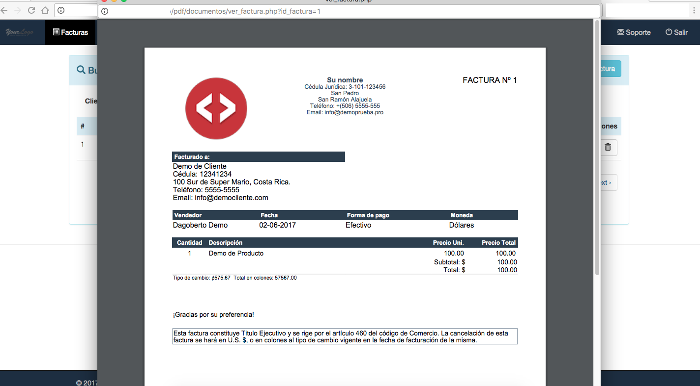

# script de Facturacion simple para Costa Rica (PHP)
Este script en php es una adaptación a uno que previamente ya cumplía con muchas de las funciones necesarias para facturar, pero se adapta a lo requerido en Costa Rica, por lo que queda abierto con la solicitud de aportar a mejorar el proyecto.
Entre las mejoras usa el web service de Ariel Orozco para traer los tipos de cambio del banco central.

<ul>
	<li>Uso del web service creado por Ariel Orozco para manejo del tipo de cambio del dolar desde del Banco Central.</li>
	<li>Uso de phpmailer para poder entregar correos a la mayoría de clientes del mercado.</li>
	<li>Manejo de moneda para dolar o colones. Los productos manejan un valor por default pero se puede ajustar al facturar.</li>
	<li>Generar pdfs, enviar por correo.</li>
	<li>Manejo general de clientes y productos.</li>
</ul>
El usuario que tiene la base de datos es demo con la clave demo1234 

Ejemplo:

Video: https://youtu.be/dgol8GEJYys

Recuerde modificar el archivo /config/db.php con sus datos de conexion.  
Recuerde modificar su email en el archivo /documentos/res/archivo_temp_email.php

El script base fue creado por Obed Alvarado (según los comentarios de algunos archivos). Se adapta de acuerdo a lo que se requiere en Costa Rica, con la facilidad de manejar dos monedas y otras optimizaciones. 
